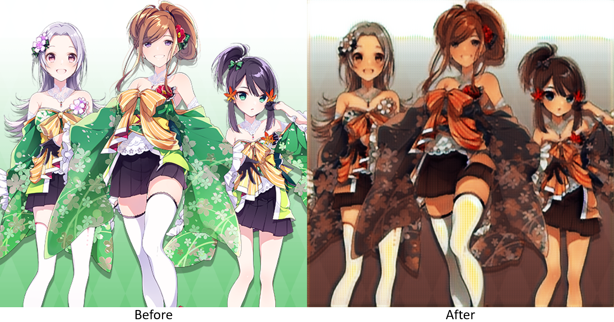
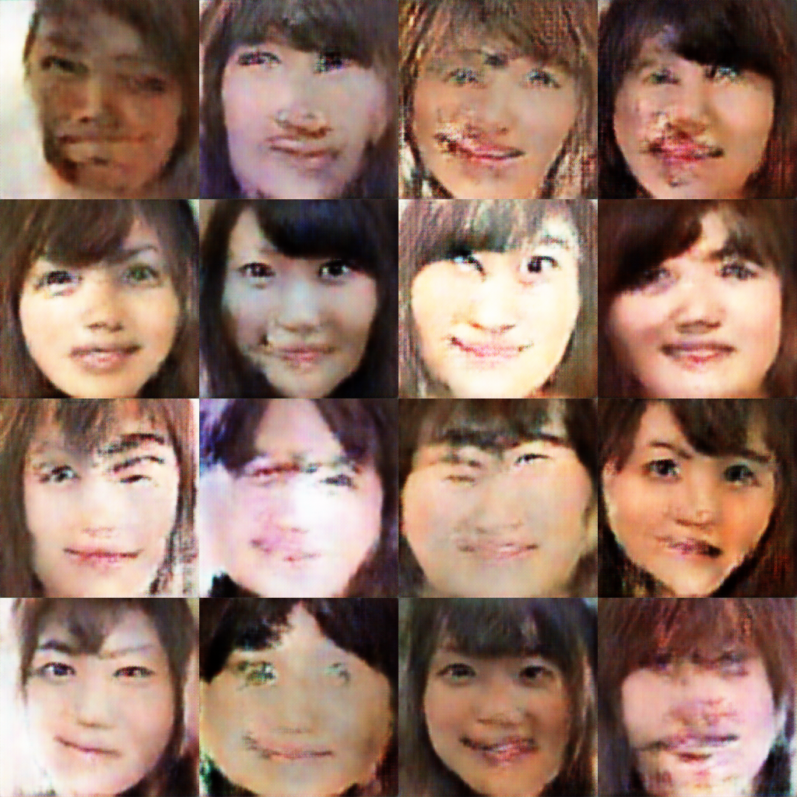

# Generative Adversarial Networks

## ConditionalGAN

ConditionalGAN - 

## CycleGAN

CycleGAN - Transfer Skin Color

  

## DCGAN

DCGAN - Deep Convolutional Generative Adversarial Networks

  

## Pix2Pix

Pix2Pix - 

## StyleGAN

StyleGAN -

## WassersteinGAN

WassersteinGAN - WassersteinGAN Gradient Penalty

  

