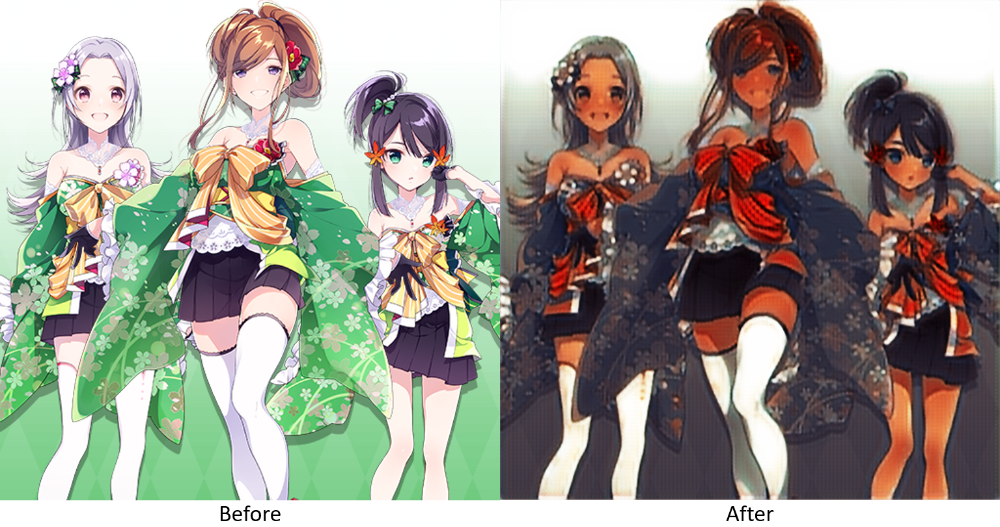
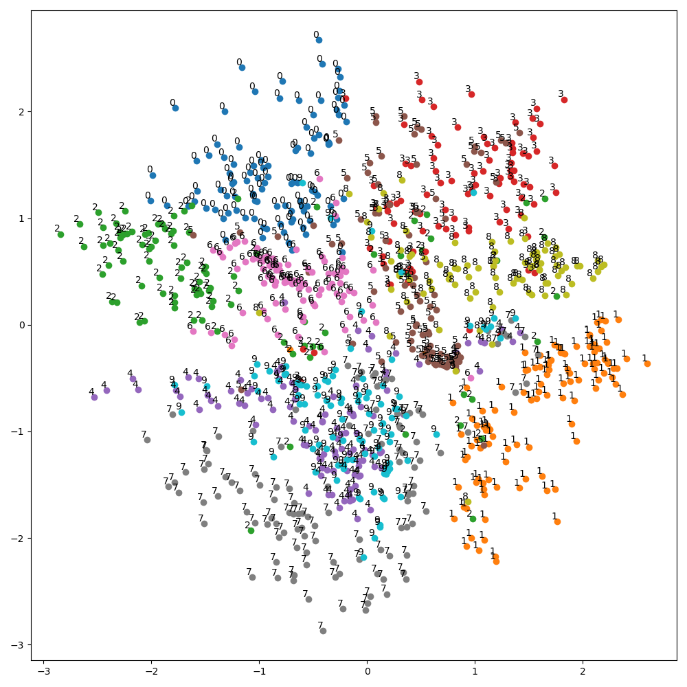
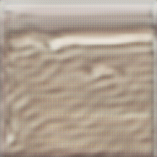

# Generative Model

## AutoEncoder

AutoEncoder - AutoEncoder MNIST

  

## ConditionalGAN

ConditionalGAN - Categorical MNIST

  

## CycleGAN

CycleGAN - Transfer Skin Color

  

## DCGAN

DCGAN - Deep Convolutional Generative Adversarial Network

  

## Pix2Pix

Pix2Pix - Transfer Paired Image

  

## PixelCNN

PixelCNN - Pixel Convolutional Neural Networks

  

## StyleGAN

StyleGAN - High Quality Fake

  

## VAE

VAE - Variational AutoEncoder

  

## VQVAE

VQVAE - Vector Quantized VAE

  

## VQVAE2

VQVAE2 - VQ-VAE-2 & PixelSNAIL

  

## WassersteinGAN

WassersteinGAN - Wasserstein GAN Gradient Penalty

  

